# IDE(Eclipse or GGTS)のインストール

## GGTS
- GGTS http://spring.io/tools/ggts
以下からダウンロード。
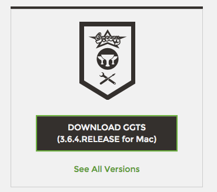

## Eclipse
- 以下から「Eclipse IDE for Java Developers」などをダウンロード
 - https://eclipse.org/downloads/
  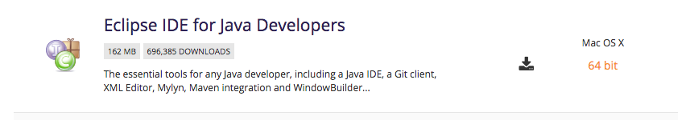
  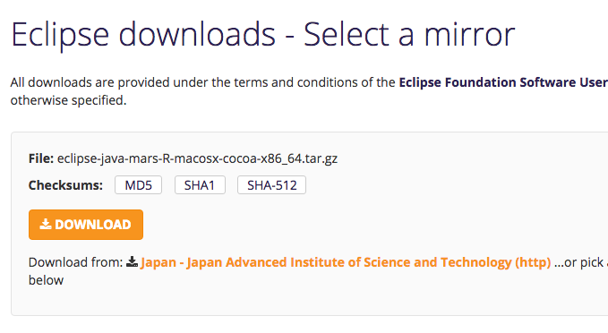
  
 - https://github.com/groovy/groovy-eclipse/wiki

# Groovy Eclipseプラグインのインストール(GGTSは不要)
## Install New Software..を実行
  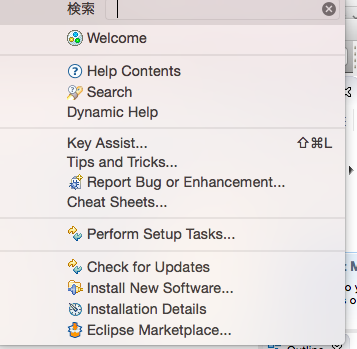

## プラグインのURLを入力

以下のURLを入力し、Groovy-Eclipse(Required)を選択する。

- Eclipse 4.5 Mars: http://dist.springsource.org/snapshot/GRECLIPSE/e4.5/
- Eclipse 4.4 Luna: http://dist.springsource.org/snapshot/GRECLIPSE/e4.4/

その他は以下を参照:

- https://github.com/groovy/groovy-eclipse/wiki

- 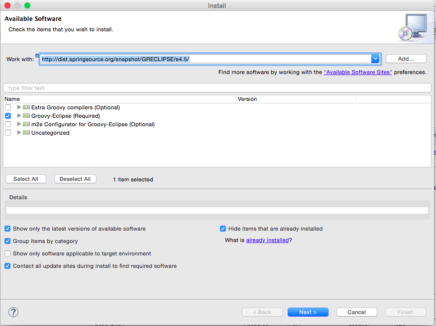

## プラグインのインストール手順

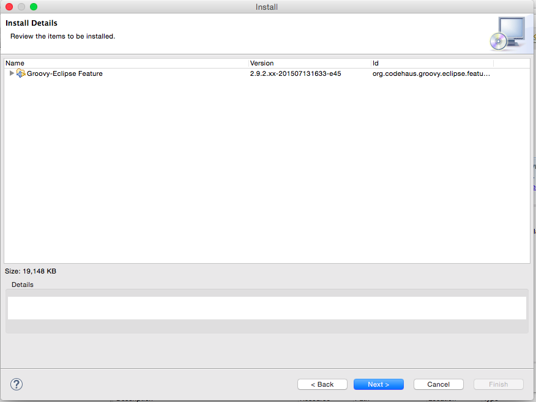 →Next
  
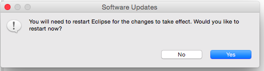 →Yes
  
# プロジェクトをインポートする

## [File]-[import]

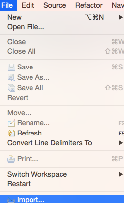

## 「Project From Git」を選択

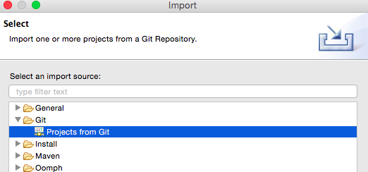

## Clone URLを選択
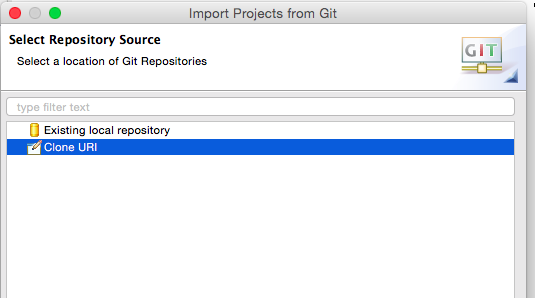

## URLを入力
以下をGitリポジトリのURIとして入力してください。

- https://github.com/uehaj/groovy-bootcamp2015.git

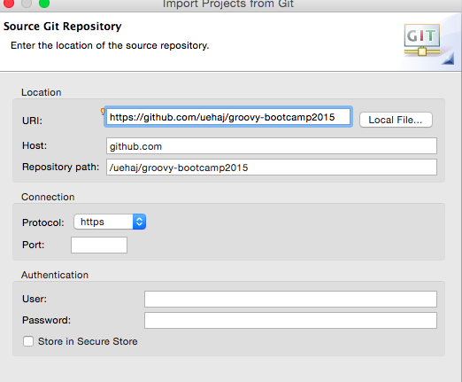

## ブランチの選択
answerとmasterの両方チェック。
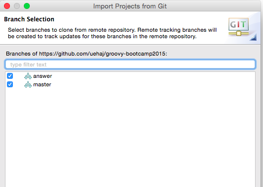

